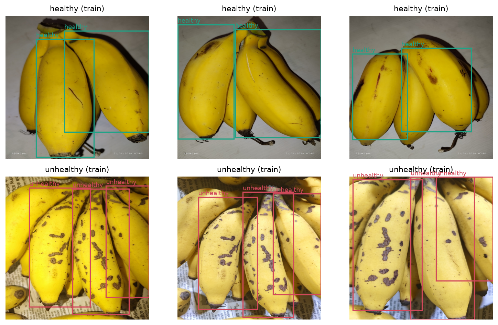
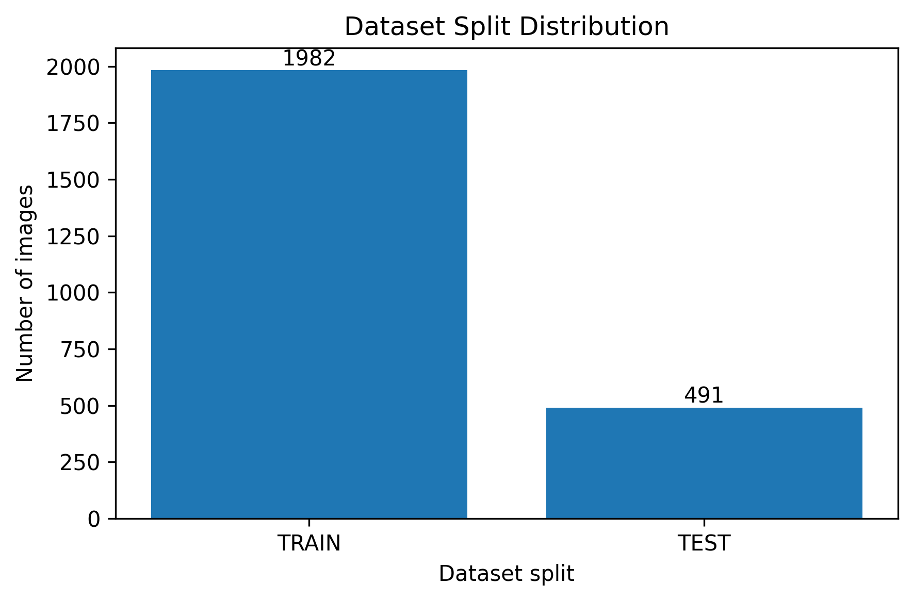
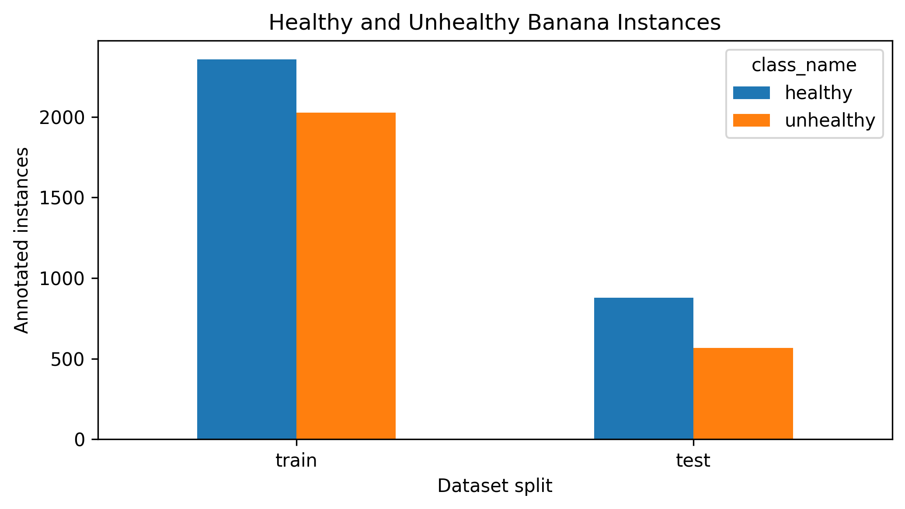
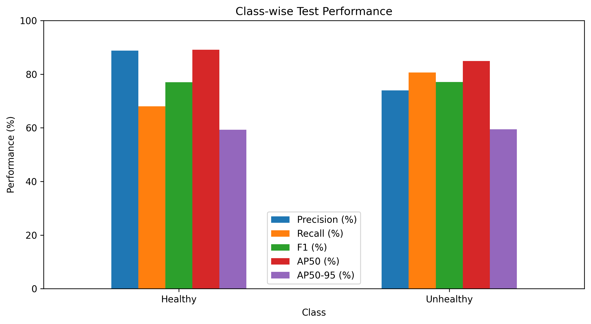
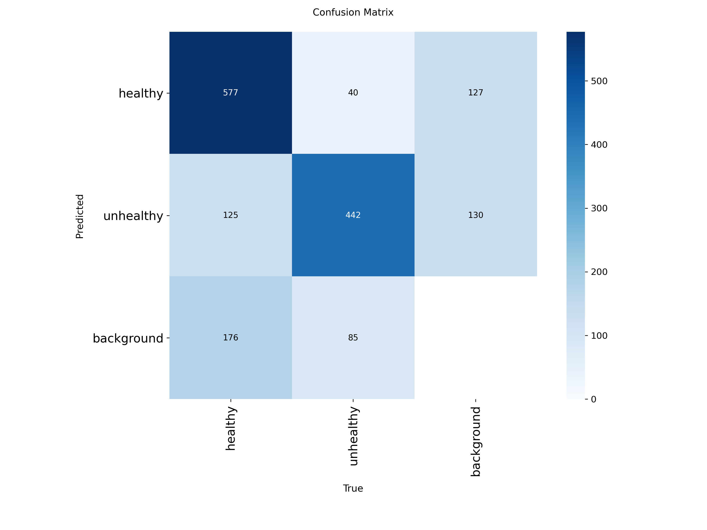

# BITOL: Banana Surface-Condition Detection

BITOL uses **YOLOv8n** to locate individual bananas and classify their visible surface condition as **healthy** or **unhealthy**. This repository contains the annotated dataset, trained checkpoints, evaluation evidence, and figures for the research project **“An Efficient Approach to Beetle Damage Detection of Banana Using Deep Learning.”**

**Verified test mAP@50: 87.04% · 2,473 images · 5,827 annotated objects · 2 classes**

The final checkpoint was evaluated locally on all **491 test images**, containing **1,445 annotated objects**. Read the [accuracy summary](results/README.md), download the [accuracy CSV](results/accuracy.csv), or inspect the [full experiment evidence](results/final_experiment/README.md).

## Dataset

### Classes and annotations

| Class ID | Label | Annotation meaning |
|---|---|---|
| 0 | `healthy` | Banana labeled as having a healthy visible surface |
| 1 | `unhealthy` | Banana labeled as having surface damage or an unhealthy appearance |

Each bounding box describes one banana. A single image can contain multiple bananas and both classes, so image counts and object counts are different. Labels describe the supplied annotations; they do not establish a biological diagnosis, the cause of damage, or a beetle species. The detailed original annotation rubric is unavailable.

### Annotated dataset examples



*Figure 1. Selected training images, left to right: `healthy_0091.jpg`, `healthy_0092.jpg`, and `healthy_0093.jpg` (top row, green boxes); `unhealthy_0381.jpg`, `unhealthy_0382.jpg`, and `unhealthy_0383.jpg` (bottom row, red boxes). Boxes show the existing ground-truth annotations, not model predictions.*

### Dataset size and split

The dataset uses an approximately **80% training / 20% test** split. Stored images are **1024 × 1024 pixels**; the final model uses **640 × 640** input. The supplied experiment has no separate validation partition.

| Partition | Images | Healthy objects | Unhealthy objects | Total objects |
|---|---:|---:|---:|---:|
| Train | 1,982 | 2,355 | 2,027 | 4,382 |
| Test | 491 | 878 | 567 | 1,445 |
| **Total** | **2,473** | **3,233** | **2,594** | **5,827** |



*Figure 2. Image distribution across the supplied training and test partitions.*



*Figure 3. Annotated object counts by class and partition. These bars count bounding boxes, not images.*

### Dataset format

```text
detection_dataset/
├── images/
│   ├── train/
│   └── test/
├── labels/
│   ├── train/
│   └── test/
├── classes.txt
├── data_paper.yaml
├── data.yaml
├── split_manifest.csv
├── audit_summary.json
└── validation_report.csv
```

Every image has a matching label file, for example `images/test/healthy_0099.jpg` and `labels/test/healthy_0099.txt`. Each label row uses YOLO detection format:

```text
class_id x_center y_center width height
```

Coordinates and dimensions are normalized relative to the image. Multiple rows describe multiple objects. The [split manifest](detection_dataset/split_manifest.csv) records membership and image/label hashes.

The research export's filenames and split membership match the local dataset. It does not include replacement raw images or labels, so the existing dataset was retained. See the [dataset documentation](detection_dataset/README.md) for further details.

## Model and verified results

| Setting | Final experiment |
|---|---|
| Architecture | YOLOv8n |
| Model input | 640 × 640 pixels |
| Epochs | 50 |
| Batch size | 4 |
| Seed | 0 |
| Training validation | Disabled (`val: false`) |
| Default checkpoint | `weights/best.pt` |
| Additional checkpoint | `weights/last.pt` |

Source export: `Bitol_80_20_NoVal_Research-20260821T060258Z-1-001`. Selected run: `yolov8n_640_batch4_80_20_noval-2`. Original [training arguments](results/final_experiment/training/args.yaml) and [checkpoint hashes](weights/README.md) are preserved.

### Test accuracy

For this object-detection task, the primary accuracy measure is **mAP@50**, which evaluates detection performance at an intersection-over-union threshold of 0.50.

| Metric | Locally verified test result |
|---|---:|
| **mAP@50** | **87.04%** |
| mAP@50:95 | 59.33% |
| Precision | 81.36% |
| Recall | 74.30% |
| F1-score | 77.67% |

The local mAP@50 is **87.0366%**, matching the supplied research report to four decimal places. Verification used `weights/best.pt`, CPU inference, input size 640, and batch size 4. The exact metrics, package versions, and checkpoint SHA-256 are stored in [verification/](results/final_experiment/verification/). The model was not retrained during integration; `last.pt` was not separately evaluated.



*Figure 4. Class-wise performance from the supplied final experiment.*



*Figure 5. Supplied test confusion matrix, including background errors for missed or unmatched detections.*

### Interpretation and dataset limitations

The local audit identifies **72 exact-duplicate image groups spanning train/test** and **119 bounding-box coordinate issues**. These findings affect interpretation of the score: reproducing mAP does not establish an independent test set. Dataset images, labels, and split membership were not changed during cleanup. See [audit evidence](detection_dataset/audit_summary.json) and [reproducibility notes](docs/reproducibility.md).

## Installation and usage

Use Python **3.10+**:

```bash
python3 -m venv .venv
source .venv/bin/activate
python -m pip install -r requirements.txt
```

On Windows, activate the environment with `.venv\Scripts\activate`. Installed verification versions are recorded in [provenance.json](results/final_experiment/verification/provenance.json); `requirements.txt` is not a historical environment lock.

### View saved accuracy

Open **[results/README.md](results/README.md)** or **[results/accuracy.csv](results/accuracy.csv)**. No inference is required to read these results.

### Predict an image, folder, or video

```bash
python main.py detection_dataset/images/test/healthy_0099.jpg
python main.py path/to/image.jpg --conf 0.25 --device cpu
```

Prediction defaults to `weights/best.pt`. Use `--model` to select another checkpoint or `--save-dir` to choose a destination. A new run saves annotated media, `detections.csv` with class/confidence/pixel coordinates, a short summary, and provenance. Video counts describe detections across frames, not unique tracked bananas.

### Evaluate the test split

```bash
python scripts/evaluate.py --device cpu
```

Evaluation explicitly uses the test split and saves aggregate/class-wise metrics, confusion matrices, PR/F1 curves, and provenance. CSV metrics use fractions from 0 to 1 unless a column explicitly says percent; displayed summaries use percentages. New runs are stored separately under `outputs/`.

### Audit the dataset or create annotation figures

```bash
python scripts/validate_dataset.py --report outputs/dataset_validation_report.csv
python scripts/generate_paper_figures.py --output outputs/paper_figures
```

The audit is read-only and returns a nonzero status while the documented dataset issues remain.

### Train a new experiment

```bash
python scripts/train.py --data path/to/development.yaml
```

New training requires documented, separate train/validation/test partitions and checks for exact-image overlap. This command does not recreate the imported no-validation training procedure. `data_paper.yaml` leaves validation unset for the evaluation workflow; the old `data.yaml` validation/test alias is historical evidence only.

## Repository organization

| Location | Purpose |
|---|---|
| `detection_dataset/` | Train/test images, YOLO labels, configurations, and audit records |
| `weights/` | Final `best.pt` and `last.pt` checkpoints and their hashes |
| `results/README.md` | Main accuracy summary |
| `results/accuracy.csv` | Test metrics in percentages |
| `results/final_experiment/` | Imported training/evaluation evidence and local verification |
| `paper_figures/01_dataset/` | Dataset distribution and bounding-box analysis |
| `paper_figures/02_training/` | Training-loss figures |
| `paper_figures/03_test_metrics/` | Performance tables and plots |
| `paper_figures/04_qualitative/` | Ground-truth examples and prediction samples |
| `paper_figures/05_ultralytics_outputs/` | Confusion matrices, metric curves, and evaluation batches |
| `scripts/` | Prediction, evaluation, training, auditing, and figure utilities |
| `notebooks/` | Historical research notebooks; inspect paths before execution |
| `docs/` | Reproducibility, cleanup, and preservation records |
| `outputs/` | Ignored local run files, library caches, and consolidated historical archives |

### Output cleanup

The local `outputs/` directory was reduced from approximately **2.4 GB to 685 MB** by removing **6,816 byte-identical duplicates**, reclaiming **1.82 GB**. Every removal was verified against a retained copy. Unique historical material is grouped under `outputs/archive/development/`, `outputs/archive/research_export/`, and `outputs/archive/previous_release/`.

The local `outputs/README.md` explains the layout, and `outputs/deduplication.csv` records each removed path, its retained copy, size, and SHA-256. Archive folders contain consolidated historical evidence rather than complete runnable project copies. These ignored local files are not included in a fresh clone. Active dataset files, models, and results were preserved; final accuracy remains in `results/`. See [cleanup details](docs/cleanup.md).

## Research and license

Research title: **“An Efficient Approach to Beetle Damage Detection of Banana Using Deep Learning.”** Citation metadata is in [CITATION.cff](CITATION.cff). The complete paper author list, venue, and DOI remain unconfirmed.

Code is distributed under the [MIT License](LICENSE). Dataset redistribution rights are not separately documented; third-party software and models retain their own terms.
