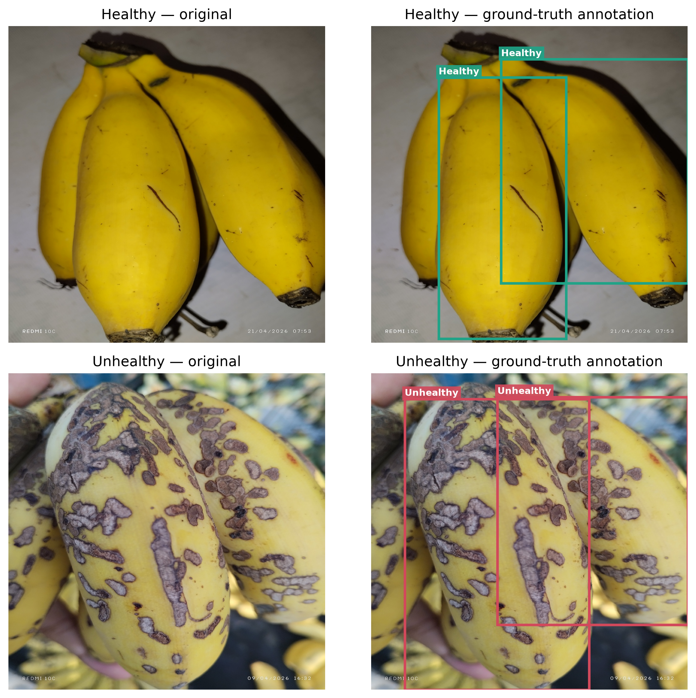

# BITOL: Banana Surface-Condition Detection

Research code accompanying **“An Efficient Approach to Beetle Damage Detection of Banana Using Deep Learning.”** BITOL uses pretrained YOLOv8n for instance-level detection of visible banana surface condition. This repository preserves the supplied dataset and reported paper results; cleanup did not train or evaluate a model.

## Paper

**Title:** An Efficient Approach to Beetle Damage Detection of Banana Using Deep Learning

**Conference / DOI / complete author list:** pending author confirmation.

**Repository:** [Bitol_Computer_Vision_System](https://github.com/mehedinaeem/Bitol_Computer_Vision_System)

## Research overview

The study investigates efficient detection of beetle-associated visible banana damage using a compact, pretrained YOLOv8n detector. Bounding boxes localize individual bananas, and each box receives a surface-condition label. The workflow covers dataset inspection, annotation visualization, model training, held-out testing, and prediction.

## Task and classes

Detect individual bananas with two operational labels: **healthy (0)** and **unhealthy (1)**. Predictions describe visible surface appearance; they do not establish biological diagnosis, causal beetle attribution, or beetle species identity.

| Class ID | Label | Operational meaning |
|---|---|---|
| 0 | healthy | Banana annotated as having a healthy visible surface. |
| 1 | unhealthy | Banana annotated as having visible surface damage or an unhealthy appearance. |

The original detailed annotation rubric is unavailable; these definitions describe the supplied labels without adding diagnostic criteria.

## Dataset

| Partition | Images | Healthy instances | Unhealthy instances | Total instances |
|---|---:|---:|---:|---:|
| Development/training | 1,982 | 2,355 | 2,027 | 4,382 |
| Reported held-out test | 491 | 878 | 567 | 1,445 |
| **Total** | **2,473** | **3,233** | **2,594** | **5,827** |

Images and YOLO labels remain in `detection_dataset/`. Stored images are 1024 × 1024; model input is 640 × 640. See the [dataset documentation](detection_dataset/README.md) for format, provenance gaps, and known split-integrity issues.

An **image count** counts stored image files; an **instance count** counts annotated bounding boxes. One image may contain several bananas and both classes, so 2,473 images contain 5,827 instances. Filename prefixes do not determine every object's class. The counts include duplicate image content and annotation rows flagged by the preserved audit; they are not counts of independent acquisition events.

### Annotation format

Each image has a same-stem `.txt` file under `detection_dataset/labels/<split>/`. Each row describes one banana in YOLO detection format:

```text
class_id x_center y_center width height
```

Coordinates and box dimensions are normalized to the image width and height. For example, `0 0.5 0.5 0.2 0.4` describes a healthy banana centered in the image with a box 20% of its width and 40% of its height. Multiple bananas produce multiple rows. [classes.txt](detection_dataset/classes.txt) defines the class order.

### Sample annotated images

The following existing paper figures show ground-truth boxes, not predictions from a newly run model. The original selection logic can draw manual examples from either split; filenames alone do not establish sample provenance.




## Final model configuration

| Setting | Paper specification |
|---|---|
| Model | YOLOv8n, pretrained |
| Input | 640 × 640 |
| Epochs / batch | 50 / 4 |
| Classes | healthy, unhealthy |

## Reported paper results

| Test metric | Reported value |
|---|---:|
| Precision | 81.36% |
| Recall | 74.30% |
| F1-score | 77.67% |
| mAP@0.50 | 87.04% |
| mAP@0.50:0.95 | 59.33% |

Reported efficiency: approximately **3.01 million parameters**, **5.96 MB**, and **6.54 ms/image on NVIDIA Tesla T4**. These values are preserved from the author's specification, not newly measured. [Results provenance](results/final_experiment/README.md) distinguishes reported results from available local evidence.

## Repository structure

```text
.
├── README.md
├── LICENSE
├── CITATION.cff
├── requirements.txt
├── main.py
├── detection_dataset/  # Images, labels, YAMLs, class names, and audit records
├── notebooks/          # Original research notebooks and convenient entry points
├── scripts/            # Training, evaluation, prediction, checks, and figures
├── results/            # Preserved reported results in final_experiment/
├── paper_figures/      # Existing annotated samples (PNG/PDF)
├── weights/            # Checkpoint placement and provenance notes
└── docs/               # Reproducibility and preservation records
```

The tracked `.gitignore` keeps local environments, backups, large source-image collections, and generated `outputs/` out of the publication tree. The dataset has one documentation home: [detection_dataset/README.md](detection_dataset/README.md). Use **[data_paper.yaml](detection_dataset/data_paper.yaml)** for publication commands; `data.yaml` remains only as historical evidence of the original validation/test alias.

## Research notebooks

The six original notebooks below were restored byte-for-byte from commit `4790a55`, including saved outputs. Those outputs are historical observations, not newly computed or verified final-paper results. None was executed during this reorganization.

| Notebook | Contents |
|---|---|
| [bitol_dataset_eda.ipynb](notebooks/bitol_dataset_eda.ipynb) | Dataset and annotation exploration, missing-file checks, and historical model-evaluation cells. |
| [check_image_label_pairs.ipynb](notebooks/check_image_label_pairs.ipynb) | Image/label pairing by split and an optional CSV report. |
| [count_banana_annotations.ipynb](notebooks/count_banana_annotations.ipynb) | Image counts, per-class bounding-box counts, and annotation checks. |
| [dataset_image_counts.ipynb](notebooks/dataset_image_counts.ipynb) | Source/resized-image counts, split summaries, plots, and missing-label checks. |
| [experiments.ipynb](notebooks/experiments.ipynb) | Dataset inventory, filename-number gaps, class distribution, and a text report. |
| [paper_class_samples_with_annotations.ipynb](notebooks/paper_class_samples_with_annotations.ipynb) | Original annotated examples, image/annotation comparisons, and suggested captions. |

The existing [01_dataset_analysis.ipynb](notebooks/01_dataset_analysis.ipynb) retains the counting logic with cleared outputs; [02_paper_figures.ipynb](notebooks/02_paper_figures.ipynb) provides a short entry point to the figure script with separate output paths. Both remain available for readers who prefer these entry points.

Read original notebook cells before running them: some use old relative paths to resized images or checkpoints, some write reports or paper figures, and the EDA notebook includes evaluation. These notebooks preserve research history; the CLI scripts below provide the documented publication workflow. Historical local assets are described in [preservation notes](docs/cleanup.md).

## Installation

Use Python **3.10+**; the original final-experiment Python/PyTorch/CUDA versions are unknown.

```bash
python3 -m venv .venv
source .venv/bin/activate
python -m pip install -r requirements.txt
```

Use `.venv\Scripts\activate` on Windows. Dependencies are not falsely pinned to a final experiment environment. [Observed local versions](docs/environment_observed.json) and an optional [local version list](docs/requirements-observed.txt) are provided separately.

## Commands

These commands are documented for future use; the cleaned scripts and notebooks were **not executed**. Training requires the original validation protocol, and evaluation/prediction require a supplied checkpoint.

**Training** — defaults: YOLOv8n, 640 pixels, 50 epochs, batch 4:

```bash
python scripts/train.py --data detection_dataset/data_paper.yaml
```

The supplied config deliberately has `val: null`. Training stops until a documented, separate validation partition is supplied; it never silently uses test for validation. Seed `0` is a documented workflow default, not a verified final-experiment seed.

**Evaluation** — explicit test split, aggregate/class-wise CSV metrics and standard Ultralytics plots:

```bash
python scripts/evaluate.py --model weights/best.pt --data detection_dataset/data_paper.yaml
```

**Prediction** — image, directory, or local video:

```bash
python scripts/predict.py path/to/image.jpg --model weights/best.pt --conf 0.25
```

`weights/best.pt` is a placement example; a verified final checkpoint is not bundled. Historical weights are preserved locally, with locations listed in [weights/README.md](weights/README.md).

**Dataset validation** — read-only checks, CSV report:

```bash
python scripts/validate_dataset.py --report outputs/dataset_validation_report.csv
```

**Paper figures** — refactored existing ground-truth illustration logic, without inference:

```bash
python scripts/generate_paper_figures.py --output outputs/paper_figures
```

Outputs use `outputs/` by default, preserving recorded results and existing figures. Evaluation uses the framework's [explicit test-split API](https://docs.ultralytics.com/modes/val/).

## Reproducibility notes and limitations

- The final 640-pixel checkpoint, original validation membership, environment, seed, and class-wise results have not been verified. Historical 1024-pixel artifacts remain in Git history and local preservation storage; they are not verified final evidence.
- Prior audits found **119 coordinate issues** and **72 exact-duplicate groups spanning train/test**. The reported test partition is therefore not established as independent by the current files. Images, labels, and split membership were not corrected or changed.
- The original `detection_dataset/data.yaml` is retained as evidence and still aliases validation to test. Use `detection_dataset/data_paper.yaml` for the publication workflow; it explicitly leaves validation unknown.
- Tesla T4 efficiency values are author-reported. CUDA/PyTorch versions, timing protocol, and checkpoint identity require confirmation.

See [detailed reproducibility notes](docs/reproducibility.md) and [preservation notes](docs/cleanup.md).

## Citation

[CITATION.cff](CITATION.cff) identifies this repository using the paper title. It records the known repository maintainer; the complete paper author list, conference, DOI, and publication date remain pending. The version identifies an unreleased documentation cleanup, not a published experiment release.

## License

Code: [MIT](LICENSE). Dataset ownership and redistribution rights are not separately documented. Third-party software and pretrained weights retain their own terms; the code license does not establish image permissions.
