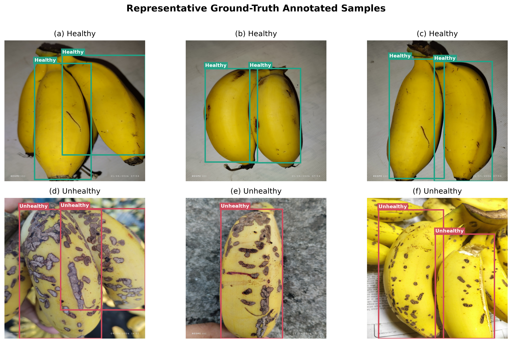

# Bitol Computer Vision System

**YOLOv8-based detection of healthy and unhealthy bananas**

Bitol is a research codebase for locating bananas in images and assigning each annotated object to one of two classes: `healthy` or `unhealthy`. It includes a YOLO-format dataset, preprocessing and annotation-audit utilities, a YOLOv8n training baseline, inference and evaluation scripts, exploratory notebooks, saved experiments, and figures for a research manuscript.

**Research status:** the repository supports experimentation, but the current dataset and evaluation protocol require corrections before publication-quality performance claims. Validation and testing share the same image directory, exact duplicate images cross the train/test boundary, and some annotations extend beyond image boundaries. The statistics below describe the files audited on **18 September 2026**; historical outputs are identified separately.

## Contents

- [I. Overview and methodology](#i-overview-and-methodology)
- [II. Repository organization](#ii-repository-organization)
- [III. Dataset documentation](#iii-dataset-documentation)
- [IV. Installation](#iv-installation)
- [V. Reproducing the workflow](#v-reproducing-the-workflow)
- [VI. Experimental configuration and recorded results](#vi-experimental-configuration-and-recorded-results)
- [VII. Notebooks and manuscript figures](#vii-notebooks-and-manuscript-figures)
- [VIII. Code inventory](#viii-code-inventory)
- [IX. Publication and reproducibility checklist](#ix-publication-and-reproducibility-checklist)
- [X. License and citation](#x-license-and-citation)

## I. Overview and methodology

The implemented task is **object detection**: a single image can contain several bananas and both classes. Filename prefixes are organizational metadata; object classes come from annotation rows.

The workflow consists of resizing source images, preparing image/label pairs, auditing annotations, fine-tuning a pretrained YOLOv8n detector, and saving predictions and evaluation artifacts. The preprocessing scripts resize directly to **1024 × 1024 pixels** with Pillow's Lanczos resampling; this can alter the aspect ratio of nonsquare source images. The training script uses that same input size. Some historical prediction logs instead record 640 × 640 inference.

The repository implements bounding-box detection and class assignment. Dedicated damage counting and webcam detection scripts are placeholders. It does not implement a measured damage-area percentage, segmentation pipeline, or disease-specific diagnosis.

## II. Repository organization

```text
Bitol_Computer_Vision_System/
├── README.md
├── LICENSE
├── requirements.txt
├── main.py                         # CLI entry point for prediction
├── yolov8n.pt                      # Starting checkpoint used by training
├── detection_dataset/
│   ├── data.yaml                   # Class mapping and split paths
│   ├── classes.txt
│   ├── images/
│   │   ├── train/                  # 1,982 images
│   │   └── test/                   # 491 images
│   └── labels/
│       ├── train/                  # 1,982 annotation files
│       └── test/                   # 491 annotation files
├── raw_images/                     # Local source material; Git-ignored
├── resized_images/                 # Intermediate image collections
├── scripts/                        # Training, inference, audits, maintenance
├── notebooks/                      # EDA, counts, evaluation, figure generation
├── paper_figures/                  # PNG and PDF ground-truth illustrations
├── runs/detect/
│   ├── models/trained/bitol_yolov8/
│   │   ├── args.yaml
│   │   ├── results.csv
│   │   ├── weights/{best,last}.pt
│   │   └── ...                     # Curves, confusion matrices, batch previews
│   └── ...                         # Historical validation and prediction runs
├── annotation_backup/              # Previous annotation versions
├── dataset_validation_report.csv
├── test_predictions_comparison.csv
├── manual_review_required.txt
├── conflict_alternatives_manual_review.txt
└── conflict_annotation_files_before_cleanup.txt
```

Local ZIP archives also exist, but `.gitignore` excludes ZIP files and raw images. The current detection images, resized images, and three checkpoint files shown above are tracked in Git. A fresh clone should not be assumed to contain local source material or archives.

## III. Dataset documentation

### A. Classes and annotation format

| Class ID | Name | Annotation meaning |
|---|---|---|
| `0` | `healthy` | Banana object assigned the healthy label |
| `1` | `unhealthy` | Banana object assigned the unhealthy label |

A formal visual grading rubric, annotation tool, annotator count, and agreement measurements are not documented. These labels should therefore be interpreted as the dataset's annotation categories.

Each image has a same-stem text file, for example:

```text
detection_dataset/images/train/healthy_0091.jpg
detection_dataset/labels/train/healthy_0091.txt
```

Each nonempty annotation row uses normalized YOLO coordinates:

```text
class_id x_center y_center width height
```

For an image of width `W` and height `H`, the box's upper-left corner is `((x_center - width/2) × W, (y_center - height/2) × H)`, with pixel dimensions `(width × W, height × H)`. An image with several objects has several rows. Metadata files named `classes.txt` are excluded from annotation-file counts.

### B. Current detection dataset

These are filesystem and annotation counts, not counts inferred from old notebook outputs. All **2,473 images have dimensions 1024 × 1024**.

| Split | Images | Share | Label files | Healthy boxes | Unhealthy boxes | Total boxes |
|---|---:|---:|---:|---:|---:|---:|
| Train | 1,982 | 80.15% | 1,982 | 2,355 | 2,027 | 4,382 |
| Test | 491 | 19.85% | 491 | 878 | 567 | 1,445 |
| **Total** | **2,473** | **100%** | **2,473** | **3,233** | **2,594** | **5,827** |

Box totals include rows flagged for out-of-bounds edges; they are not counts of fully validated boxes. File counts also include duplicate image content.

The distinction between filename categories and actual object labels matters:

| Split | `healthy_*` filenames | `unhealthy_*` filenames | Only healthy annotations | Only unhealthy annotations | Both classes |
|---|---:|---:|---:|---:|---:|
| Train | 1,043 | 939 | 944 | 886 | 152 |
| Test | 284 | 207 | 252 | 192 | 47 |
| **Total** | **1,327** | **1,146** | **1,196** | **1,078** | **199** |

### C. Intermediate images and archives

The current `resized_images/` collection contains **2,235 images**:

| Folder | Images | Folder | Images |
|---|---:|---|---:|
| `healthy` | 205 | `unhealthy` | 519 |
| `healthy01` | 211 | `unhealthy01` | 88 |
| `healthy02` | 229 | `unhealthy02` | 125 |
| `healthy03` | 500 | `unhealthy03` | 358 |

These folders do not form a complete one-to-one reconstruction of the current detection dataset. Local raw-image folders contain 265 images in `healthy02`, 703 in `healthy03`, 195 in `unhealthy02`, and 376 in `unhealthy03`; raw assets are not distributed through Git.

| Local archive | Train images | Validation images | Test images | Total |
|---|---:|---:|---:|---:|
| `detection_dataset.zip` | 1,698 | 486 | 248 | 2,432 |
| `detection_dataset_80.zip` | 1,982 | — | 491 | 2,473 |

Archive counts were read from ZIP member listings. Matching counts do not establish identical file contents or annotation versions. Neither archive is a versioned public dataset release; no dataset DOI or download service is configured in the repository.

### D. Split configuration and data integrity

The checked-in [dataset configuration](detection_dataset/data.yaml) is:

```yaml
train: images/train
val: images/test
test: images/test
nc: 2
names:
  0: healthy
  1: unhealthy
```

**There is no independent validation directory in the current dataset.** Both `val` and `test` resolve to `images/test`. Using this configuration for model selection and final testing exposes the final evaluation images during development.

A fresh run of [the validator](scripts/validate_yolo_dataset.py) produced:

| Check | Train | Test | Total |
|---|---:|---:|---:|
| Missing labels | 0 | 0 | 0 |
| Orphan labels | 0 | 0 | 0 |
| Empty labels | 0 | 0 | 0 |
| Malformed rows | 0 | 0 | 0 |
| Invalid class IDs | 0 | 0 | 0 |
| Duplicate annotation rows | 0 | 0 | 0 |
| Git conflict markers | 0 | 0 | 0 |
| Invalid box coordinates | 109 | 10 | **119** |

The 119 coordinate issues occur in 113 label files: 59 rows have a right edge greater than 1 and 60 have a bottom edge greater than 1 under the validator's strict comparisons. Inspect the magnitude and original annotation before deciding whether each issue is rounding or a substantive box error. The validator returns exit status **1** while these errors remain. See [the existing detailed report](dataset_validation_report.csv).

A separate SHA-256 audit of image bytes found **218 duplicate-content groups**, including **72 groups containing images in both train and test**. These are counts of distinct hashes shared by multiple files, not counts of duplicate pairs. This audit does not detect visually similar images saved with different compression or near-duplicate views.

The [manual-review record](manual_review_required.txt) names `healthy_0717.txt`, with alternatives described in [the conflict notes](conflict_alternatives_manual_review.txt). The current active labels contain no Git conflict markers; the old notes are not proof that the semantic annotation disagreement was resolved.

### E. Provenance still needed

The codebase does not establish collection locations and dates, camera settings, cultivar information, subject/session identifiers, sampling protocol, image ownership, or a separate dataset license. Add these from the original collection records before releasing the dataset as a research contribution. Do not infer acquisition provenance from filenames or notebook execution timestamps.

## IV. Installation

Run shell commands from the repository root unless stated otherwise. Use a Python environment compatible with the installed PyTorch and Ultralytics versions. The validator's type syntax requires Python 3.10 or newer; the repository does not define a tested version matrix.

```bash
python3 -m venv .venv
source .venv/bin/activate
python -m pip install --upgrade pip
python -m pip install -r requirements.txt
```

On Windows, activate with `.venv\Scripts\activate` instead.

[requirements.txt](requirements.txt) lists Pillow, ipykernel, Jupyter, Matplotlib, pandas, and Ultralytics without version pins. Notebooks also import NumPy and PyYAML, normally installed through dependencies. CPU execution is supported by the saved experiment; training on a suitable GPU can be configured through Ultralytics. No GPU-specific environment is supplied here.

To record the environment used for a new experiment:

```bash
mkdir -p outputs
python --version
python -m pip freeze > outputs/environment.txt
```

A new installation is not guaranteed to recreate the historical environment because dependencies are unpinned.

## V. Reproducing the workflow

### A. Audit the supplied dataset

```bash
python scripts/validate_yolo_dataset.py \
  --dataset detection_dataset \
  --report outputs/dataset_validation_report.csv
```

This writes a CSV with `split`, `category`, `path`, `line`, and `details`. The current snapshot is expected to fail on the 119 coordinate issues above. The script checks labels in `train` and `test`; it does not check image-content duplication or certify annotation correctness.

Reproduce the exact-byte duplicate check without changing dataset files:

```bash
python - <<'PY'
from collections import defaultdict
from hashlib import sha256
from pathlib import Path

groups = defaultdict(list)
for split in ('train', 'test'):
    for image in sorted((Path('detection_dataset/images') / split).glob('*.jpg')):
        groups[sha256(image.read_bytes()).hexdigest()].append(image)
duplicates = [paths for paths in groups.values() if len(paths) > 1]
cross_split = [paths for paths in duplicates
               if len({path.parent.name for path in paths}) > 1]
print('Duplicate-content groups:', len(duplicates))
print('Cross-split duplicate groups:', len(cross_split))
for paths in cross_split:
    print(', '.join(str(path) for path in paths))
PY
```

For a new paper experiment, resolve annotation issues, group duplicate/related images together, and create disjoint train, validation, and test partitions. Preserve the original snapshot and record the new split manifest. The existing split scripts do not implement this complete procedure.

### B. Run inference with the bundled checkpoint

```bash
python main.py detection_dataset/images/test --conf 0.25 --no-show
```

The default model is `runs/detect/models/trained/bitol_yolov8/weights/best.pt`. To select it explicitly for one image:

```bash
python scripts/predict.py detection_dataset/images/train/healthy_0091.jpg \
  --model runs/detect/models/trained/bitol_yolov8/weights/best.pt \
  --conf 0.25 --no-show
```

Annotated outputs are saved beneath `runs/detect/` with run name `predict`; repeated runs may receive a new directory name. The script prints the actual output location. Omit `--no-show` to display the first annotated result with Matplotlib. The wrapper requires an existing local source path; it does not expose webcam indices or URL sources.

### C. Train the baseline

After reviewing the data issues and choosing the intended split protocol:

```bash
python scripts/train_yolo.py
```

This loads `yolov8n.pt` and requests 50 epochs, image size 1024, batch size 4, project `models/trained`, and run name `bitol_yolov8`. The script has no command-line hyperparameter options; edit its `model.train(...)` arguments for a new configuration.

Use the output directory reported by training when selecting the resulting checkpoint. The archived checkpoint resides under `runs/detect/models/trained/bitol_yolov8/`, while the training script passes a relative project path. The prediction and evaluation scripts do not automatically discover a newly created run.

### D. Evaluate

To evaluate the bundled checkpoint using the configured test split:

```bash
python scripts/test_evaluate.py
```

It prints mAP50, mAP50–95, precision, and recall. This evaluates the current files with a historical checkpoint; it does not reproduce the historical dataset or provide an independent test protocol while `val` and `test` are shared.

For a different checkpoint or dataset configuration, use the same API pattern as the existing scripts:

```python
from ultralytics import YOLO

model = YOLO("path/to/your/run/weights/best.pt")
metrics = model.val(data="path/to/your/data.yaml", split="test")
print("Precision:", metrics.box.mp)
print("Recall:", metrics.box.mr)
print("mAP50:", metrics.box.map50)
print("mAP50-95:", metrics.box.map)
```

`scripts/evaluate.py` calls `model.val()` without explicit dataset or split arguments and therefore relies on checkpoint/framework configuration. Use explicit arguments for a recorded research experiment.

### E. Prepare additional source images

The following are maintenance tools, not necessary steps for using the supplied dataset:

- `resize_images.py` processes supported images recursively under `raw_images/`, preserves relative folder structure, and skips existing outputs.
- `resize_images01.py` processes only `healthy03` and `unhealthy03`.
- `split_dataset.py` takes a sorted, unshuffled 80/20 split within each resized-image folder and copies images only.
- `split_dataset01.py` shuffles only `healthy03` and `unhealthy03` with seed 42, copies an 80/20 split, and copies matching existing labels where available.

Both split scripts retain existing destination files. Running them over a populated dataset can leave stale membership or introduce overlap; neither is an exact reconstruction command for the audited dataset. Keep image/label pairs together and validate any new release after preparation.

## VI. Experimental configuration and recorded results

### A. Archived training configuration

Source: [saved args.yaml](runs/detect/models/trained/bitol_yolov8/args.yaml).

| Parameter | Recorded value |
|---|---|
| Task / model | Detection / `yolov8n.pt` |
| Epochs / batch size | 50 / 4 |
| Image size | 1024 |
| Device | CPU |
| Seed / deterministic mode | 0 / `true` |
| Optimizer setting | `auto` |
| Initial learning-rate setting / final factor | 0.01 / 0.01 |
| Momentum / weight decay | 0.937 / 0.0005 |
| Warm-up epochs | 3 |
| Mosaic / close mosaic | 1.0 / final 10 epochs |
| Horizontal flip / vertical flip | 0.5 / 0.0 |
| Translation / scale | 0.1 / 0.5 |
| HSV augmentation H / S / V | 0.015 / 0.7 / 0.4 |

With `optimizer: auto`, the stored learning-rate and momentum settings alone do not establish the optimizer's effective selected values. Preserve the training log in future experiments. The archived configuration includes a Windows save path and does not freeze the dataset contents that existed during training.

### B. Historical training validation metrics

Source: [50-epoch results.csv](runs/detect/models/trained/bitol_yolov8/results.csv). Scores are fractions on a 0–1 scale.

| Recorded row | Precision | Recall | mAP50 | mAP50–95 |
|---|---:|---:|---:|---:|
| Epoch 46: highest recorded mAP50–95 | 0.93292 | 0.94120 | 0.95883 | 0.63937 |
| Epoch 50: final row | 0.93638 | 0.93636 | 0.95748 | 0.62387 |

These are historical validation metrics, not verified performance on the current 491-image test set. Selecting the maximum CSV row does not independently establish which epoch produced the bundled `best.pt`.

### C. Historical notebook evaluation

[bitol_dataset_eda.ipynb](notebooks/bitol_dataset_eda.ipynb) contains a completed evaluation on an earlier **51-image, 110-instance** test set:

| Class | Precision | Recall | mAP50 | mAP50–95 |
|---|---:|---:|---:|---:|
| Overall | 0.745939 | 0.746139 | 0.746294 | 0.408367 |
| Healthy | 0.553352 | 0.835562 | 0.645898 | 0.304282 |
| Unhealthy | 0.938526 | 0.656716 | 0.846691 | 0.512452 |

Another cell records an incomplete evaluation on a different 248-image snapshot. Notebook outputs also contain older dataset counts. Re-execute relevant cells against a frozen dataset before copying any numbers into a manuscript.

### D. Historical prediction-count analysis

[test_predictions_comparison.csv](test_predictions_comparison.csv) contains 485 historical records:

| Stored category | Images |
|---|---:|
| Perfect Match | 235 |
| Count / Bounding Box Discrepancy | 141 |
| False Unhealthy Alarm (Pure Healthy GT) | 55 |
| False Healthy Alarm (Pure Unhealthy GT) | 22 |
| Class Swap (Unhealthy GT → Pred Healthy Only) | 17 |
| Class Swap (Healthy GT → Pred Unhealthy Only) | 14 |
| Missed All Detections | 1 |
| **Total** | **485** |

These compare per-class object counts. “Perfect Match” does not establish correct box localization, and the discrepancy category does not measure IoU. They are diagnostic summaries, not detection accuracy or mAP. The 485-record log differs from the current 491-image test set.

## VII. Notebooks and manuscript figures

Launch Jupyter with:

```bash
jupyter notebook
```

| Notebook | Purpose and execution notes |
|---|---|
| [check_image_label_pairs.ipynb](notebooks/check_image_label_pairs.ipynb) | Checks JPG/TXT pairing in train/test and writes `image_label_pair_report.csv`; works from root or `notebooks/`. |
| [count_banana_annotations.ipynb](notebooks/count_banana_annotations.ipynb) | Reports filename categories, annotation counts, and basic label checks; works from root or `notebooks/`. |
| [dataset_image_counts.ipynb](notebooks/dataset_image_counts.ipynb) | Counts resized and detection images; contains historical train/val/test assumptions and saved outputs. |
| [experiments.ipynb](notebooks/experiments.ipynb) | Dataset inventory and annotation progress; uses `../` paths and writes `dataset_report.txt`. Run with working directory `notebooks/`. |
| [bitol_dataset_eda.ipynb](notebooks/bitol_dataset_eda.ipynb) | Exploratory checks, historical evaluation, and prediction; uses relative paths and contains stale/interrupted outputs. |
| [paper_class_samples_with_annotations.ipynb](notebooks/paper_class_samples_with_annotations.ipynb) | Ground-truth example selection and PNG/PDF export; works from root or `notebooks/`. |

The figure notebook exposes `SPLIT`, `SAMPLE_FILES`, `SAMPLES_PER_CLASS`, `SEED`, `MIN_BOX_AREA`, and `DPI`. Its current configuration uses three examples per class, seed 42, and 300-DPI PNG export. Manual filenames may be resolved from another split, so check actual selected image paths before describing a figure as exclusively train or test. For automatic selection, set each class's `SAMPLE_FILES` list to `[]`.



*Ground-truth annotation examples; these boxes are not model predictions.*

| Figure | PNG | PDF |
|---|---|---|
| Training class examples | [PNG](paper_figures/all_classes_annotated_train.png) | [PDF](paper_figures/all_classes_annotated_train.pdf) |
| Test class examples | [PNG](paper_figures/all_classes_annotated_test.png) | [PDF](paper_figures/all_classes_annotated_test.pdf) |
| Training originals and annotations | [PNG](paper_figures/original_vs_annotation_train.png) | [PDF](paper_figures/original_vs_annotation_train.pdf) |
| Test originals and annotations | [PNG](paper_figures/original_vs_annotation_test.png) | [PDF](paper_figures/original_vs_annotation_test.pdf) |

Changing `SPLIT` and rerunning the notebook writes the corresponding filenames and can overwrite previous exports. Ground-truth figures illustrate dataset labeling; saved confusion matrices and PR/F1 curves under `runs/` belong to their historical runs.

## VIII. Code inventory

| File(s) under `scripts/` | Role |
|---|---|
| `train_yolo.py` | Fine-tunes YOLOv8n with fixed training arguments. |
| `predict.py` | Inference CLI, saved annotated images, optional display; also invoked by `main.py`. |
| `test_evaluate.py`, `evaluate.py` | Evaluates the bundled model with explicit test settings or checkpoint defaults, respectively. |
| `validate_yolo_dataset.py` | Annotation and pairing audit with CSV output and failure exit status. |
| `resize_images.py`, `resize_images01.py` | Full-tree or selected-folder resizing. |
| `split_dataset.py`, `split_dataset01.py` | Legacy preparation variants with different source selection and shuffle behavior. |
| `analyze_test_predictions.py` | Compares an embedded historical prediction log with current test labels and prints count diagnostics; does not write the comparison CSV. |
| `parse_test_log.py` | Parses `test_predictions_log.txt`, assuming 640 × 640 log entries; uses filename prefixes as proxy categories. |
| `rename_misnamed_dataset.py` | Renames image/label pairs according to majority annotation class; dry run by default, `--execute` applies changes. |
| `sync_resized_images.py` | Uses MD5 byte matching to align resized filenames with dataset names; dry run by default, `--execute` applies changes. |
| `rename_images.py` | Renames selected raw-image folders using configured starting indices; mutates files immediately. |
| `copy_mismatches.py` | Copies a hard-coded list of mismatch samples for review. |
| `organize_mismatch_folders.py`, `rename_mismatch_files.py` | Moves/renames review files; uses machine-specific absolute paths and mutates files immediately. |
| `count_damage.py`, `webcam_detection.py` | Placeholders. |
| `family.pl` | Unrelated Prolog exercise; not part of the computer-vision pipeline. |

Maintenance scripts are not a required sequential pipeline. Review their paths, source lists, and overwrite/rename behavior before applying them to a new dataset. Renaming an image by majority class does not correct its annotations or make it a single-class image.

## IX. Publication and reproducibility checklist

The README follows a research-artifact organization suitable for accompanying an IEEE-style manuscript. It does not establish publication readiness or replace a validated experimental protocol.

Before reporting final results:

- [ ] Resolve the 119 coordinate issues and document the `healthy_0717` annotation decision.
- [ ] Remove train/test content leakage by grouping exact duplicates, near duplicates, and related acquisition sessions before splitting.
- [ ] Introduce an independent validation split; reserve the test set for final evaluation.
- [ ] Publish collection provenance, class definitions, annotation instructions, quality-control procedure, and dataset usage rights.
- [ ] Freeze image/label hashes and split membership under a dataset version; distinguish unique images from stored files.
- [ ] Record dependency versions, hardware, effective optimizer settings, random seeds, checkpoint identity, and the source commit.
- [ ] Rerun training and evaluation on that frozen release; report per-class and aggregate metrics with the exact input size and evaluation settings.
- [ ] Add appropriate comparisons, ablations, and repeated-run variability for the manuscript's claims.
- [ ] Regenerate tables and figures from the same release and replace stale notebook outputs.
- [ ] Archive the release with a stable URL/DOI and add the final paper citation when available.

## X. License and citation

The repository includes the [MIT License](LICENSE), copyright © 2026 MD MEHEDI HASAN NAEEM. Dataset provenance and redistribution terms are not separately documented. Third-party software and pretrained model terms should be recorded separately from the repository's code license.

No published-paper citation, DOI, or versioned dataset citation is supplied in this repository. When citing this artifact, identify the repository title, author, exact commit/release, and access date; add a formal paper citation only once its bibliographic details are established.
